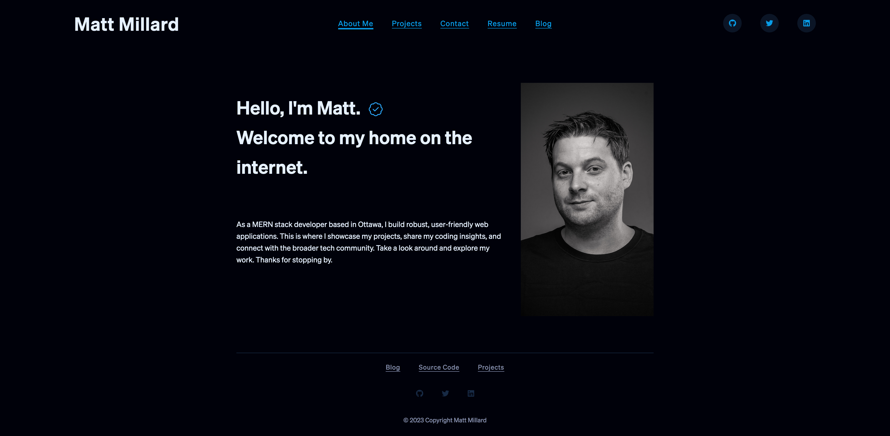

# Portfolio SPA React

## Description

This repository contains the source code for my personal website - a React SPA showcasing my journey in web development, my skills, and portfolio of projects.

## Table Of Contents

- [Project Setup Guide](#project-setup-guide)
- [Screenshots](#screenshots)
- [Links](#links)
- [Technologies Used](#technologies-used)
- [Node Packages Used](#node-packages-used)
- [Contribution](#contribution)
- [License](#license)
- [Questions](#questions)

## Project Setup Guide

1. Prerequisites: You'll need to have `Node.js` and `npm` installed on your local machine.

2. Clone the Repository: Run git clone https://github.com/matthew-millard/portfolio-spa-react.git

Navigate to the Directory: Run `cd portfolio-spa-react`

Install Dependencies: Run `npm install` to install all required dependencies.

Start the Server: Run `npm start` to start the local server. Your application will run at http://localhost:3000

## Screenshots

## Links

[Github Pages](https://matthew-millard.github.io/portfolio-spa-react/)

[Github Repository](https://github.com/matthew-millard/portfolio-spa-react)

## Technologies Used

- React

- CSS Modules

## Node Packages Used

- Fontawesome

## Contribution

Your contributions to the refinement and enhancement of this personal portfolio website are much appreciated. Here are some ways you could contribute:

1. Project Feedback: If you have any suggestions or feedback to enhance the website's design, functionality, or content, your insights are welcome. This could range from the portfolio's UI/UX design, the displayed projects, the color scheme, to the loading speed, etc.

2. Bug Reports: If you encounter any bugs or glitches while navigating through the website, please let me know. This includes any broken links, faulty design elements, browser compatibility issues, or any other unexpected behaviors.

3. New Feature Suggestions: If you think of a feature that would enhance the user experience of this website, I would love to hear about it. It could be anything from an innovative layout design, new interactive elements, to adding a blog section or an improved contact form.

4. Code Review: If you're technically inclined, you're welcome to review the website's code. I appreciate any insights or suggestions to improve code readability, efficiency, and maintainability.

5. Documentation Improvement: If you see areas where the website's documentation could be enhanced or clarified, your input is invaluable.

To contribute, you can reach out to me through the 'Contact' section of the website, or alternatively, open an issue on the website's Github repository if it's available. Your perspective and insights will help improve the quality of this portfolio and enhance its value to other visitors. Thank you for your interest and your willingness to contribute!

## License

MIT License A short and simple permissive license with conditions only requiring preservation of copyright and license notices. Licensed works, modifications, and larger works may be distributed under different terms and without source code.

## Questions

If you have any questions related to this project, please don't hesitate to [email me](matthew.richie.millard@gmail.com).

If you would like to check out my other projects on Github: [matthew-millard](https://github.com/matthew-millard).
